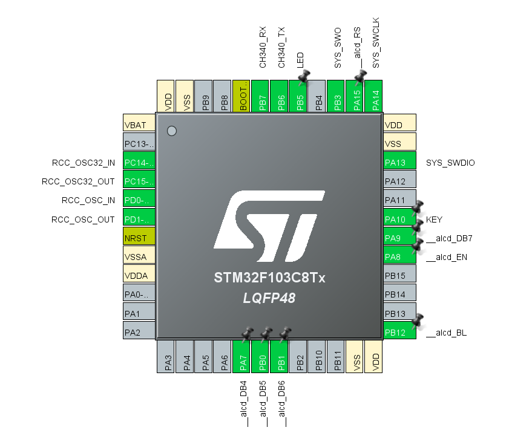
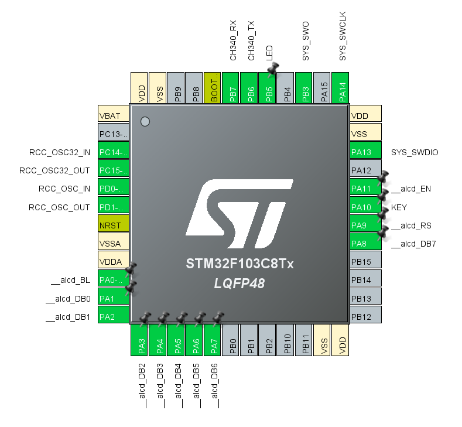

# aLCD Library - API Reference

This library provides a complete driver for HD44780-compatible 16x2 alphanumeric LCD displays. It supports both 4-bit and 8-bit communication modes, offering flexibility for different hardware configurations and project requirements.

## Communication Modes

The library is available in two versions located in separate folders:

```
STM32_HAL_aLCD_GPIO
└── source/
    ├── 4-bit mode/
    │   ├── alcd.h
    │   └── alcd.c
    └── 8-bit mode/
        ├── alcd.h
        └── alcd.c
```

### 4-Bit Mode

**Description:**  
Data is transmitted through 4 pins (DB4-DB7). Each byte is sent in two stages (upper and lower nibble).

**Advantages:**
- Fewer pins required (6 pins total: RS, EN, DB4-DB7)
- Ideal for microcontrollers with limited GPIO
- Simplified wiring and reduced hardware complexity
- Backlight control available (optional 7th pin)

**Disadvantages:**
- Slower communication speed (two cycles per byte)

**Pin Requirements:**
- 2 Control pins: RS, EN
- 4 Data pins: DB4, DB5, DB6, DB7
- 1 Optional pin: Backlight (BL)

**Use Cases:**
- Projects with limited GPIO availability
- Simple applications where speed is not critical
- Battery-powered devices (fewer active pins)

---

### 8-Bit Mode

**Description:**  
All 8 data bits (DB0-DB7) are transmitted in parallel simultaneously.

**Advantages:**
- Faster communication speed (complete byte sent in one cycle)
- Simpler implementation and timing
- More reliable data transmission

**Disadvantages:**
- More pins required (10 pins total: RS, EN, DB0-DB7)
- More complex wiring

**Pin Requirements:**
- 2 Control pins: RS, EN
- 8 Data pins: DB0, DB1, DB2, DB3, DB4, DB5, DB6, DB7
- 1 Optional pin: Backlight (BL)

**Use Cases:**
- Performance-critical applications
- Projects with abundant GPIO resources
- Industrial applications requiring high reliability
- Systems with frequent LCD updates

---

## Hardware Pin Configuration

You can reassign LCD pins to any desired microcontroller GPIO pins by modifying the **User Labels** in STM32CubeMX.

**You MUST configure all LCD pins in STM32CubeMX before using this library.** The GPIO definitions are automatically generated by CubeMX when you assign User Labels to the pins.

### CubeMX Configuration Steps:
1. Open Pinout & Configuration tab
2. Select desired GPIO pins
3. Set GPIO mode to `GPIO_Output`
4. Set GPIO output level to `Push Pull`
5. Set GPIO speed to `Low` or `Medium`
6. Enter the exact User Labels as shown above (e.g., __alcd_RS, __alcd_EN, etc.)
7. Generate code to create the GPIO definitions

### 4-Bit Mode Configuration:
Set these User Labels in CubeMX:
- **Control Pins:**
  - RS pin → `__alcd_RS`
  - EN pin → `__alcd_EN`
- **Data Pins:**
  - DB4 pin → `__alcd_DB4`
  - DB5 pin → `__alcd_DB5`
  - DB6 pin → `__alcd_DB6`
  - DB7 pin → `__alcd_DB7`
  


#### Default Pin Assignments - 4-Bit Mode

```c
/* Control Pins */
RS  -> PA15
EN  -> PA8

/* Data Pins */
DB4 -> PA7
DB5 -> PB0
DB6 -> PB1
DB7 -> PA9
```

### Backlight Configuration (Optional)

The backlight feature is optional for both modes. To enable it:

- **Optional Backlight:**
  - BL pin → `__alcd_BL`
  
#### Default Pin Assignments - 8-Bit Mode
```c
/* Optional Backlight */
BL  -> PB12
```

### 8-Bit Mode Configuration:
Set these User Labels in CubeMX:
- **Control Pins:**
  - RS pin → `__alcd_RS`
  - EN pin → `__alcd_EN`
- **Data Pins:**
  - DB0 pin → `__alcd_DB0`
  - DB1 pin → `__alcd_DB1`
  - DB2 pin → `__alcd_DB2`
  - DB3 pin → `__alcd_DB3`
  - DB4 pin → `__alcd_DB4`
  - DB5 pin → `__alcd_DB5`
  - DB6 pin → `__alcd_DB6`
  - DB7 pin → `__alcd_DB7`
  


#### Default Pin Assignments - 4-Bit Mode

```c
/* Control Pins */
RS  -> PA9
EN  -> PA11

/* Data Pins */
DB0 -> PA1
DB1 -> PA2
DB2 -> PA3
DB3 -> PA4
DB4 -> PA5
DB5 -> PA6
DB6 -> PA7
DB7 -> PA8
```


> [!IMPORTANT]
> The backlight pin (typically LCD pin 16, LED-) should be driven through an NPN transistor to handle the current properly and protect the microcontroller.

---

## API Functions

### Initialization

#### `void alcd_init(void)`

**Description:**  
Initializes the LCD module. This function **must be called first** before using any other LCD function.

**Operation:**
- Confirms GPIO pins are configured as outputs (this is done in CubeMX)
- Executes HD44780 initialization sequence
- Sets 4-bit or 8-bit interface mode
- Enables the display
- Clears the screen

**Parameters:**  
None

**Returns:**  
None

**Example:**
```c
#include "aKaReZa.h"
#include "alcd.h"

int main(void) 
{
    alcd_init(); // Initialize LCD - Must be called first
    
    // Your code here
    
    while(1)
    {
        // Main loop
    }
}
```

> [!IMPORTANT]
> Currently, this library supports **only 16×2 LCD displays**. For different sizes, library modifications may be required.

---

### Display Control

#### `void alcd_clear(void)`

**Description:**  
Clears the entire display and returns the cursor to the home position (0, 0).

**Parameters:**  
None

**Returns:**  
None

**Execution Time:**  
~1.52ms (longest command execution time)

**Example:**
```c
alcd_clear(); // Clear display and reset cursor
```

---

#### `void alcd_display(bool _alcd_Display, bool _alcd_Cursor, bool _alcd_Blink)`

**Description:**  
Controls the display, cursor, and blink settings.

**Parameters:**
- `_alcd_Display` - Display state
  - `true`: Turn display ON
  - `false`: Turn display OFF
- `_alcd_Cursor` - Cursor visibility
  - `true`: Show cursor (underline)
  - `false`: Hide cursor
- `_alcd_Blink` - Cursor blink state
  - `true`: Enable blinking (block cursor)
  - `false`: Disable blinking

**Returns:**  
None

**Default State:**  
Display ON, Cursor OFF, Blink OFF

**Examples:**
```c
// Display ON, cursor and blink OFF (default)
alcd_display(true, false, false);

// Display ON, cursor ON (underline), blink OFF
alcd_display(true, true, false);

// Display ON, cursor OFF, blink ON (block blink)
alcd_display(true, false, true);

// Display ON, cursor ON with blink (underline + block)
alcd_display(true, true, true);

// Turn off display completely
alcd_display(false, false, false);
```

> [!NOTE]
> By default, the display is ON. You don't need to explicitly enable it after initialization.

---

### Cursor Control

#### `void alcd_gotoxy(uint8_t _alcd_x, uint8_t _alcd_y)`

**Description:**  
Moves the cursor to the specified position on the LCD.

**Parameters:**
- `_alcd_x` - Column position (0 to 15)
- `_alcd_y` - Row position (0 or 1)

**Returns:**  
None

**Valid Ranges:**
- Column: 0-15 (16 columns)
- Row: 0-1 (2 rows)

**Examples:**
```c
alcd_gotoxy(0, 0);   // First column, first row (home position)
alcd_gotoxy(5, 1);   // Sixth column, second row
alcd_gotoxy(15, 0);  // Last column, first row
alcd_gotoxy(0, 1);   // First column, second row
```

> [!WARNING]
> - First row index is `0`, second row index is `1` (not 1 and 2)
> - Exceeding valid ranges may cause unexpected behavior

---

### Data Writing

#### `void alcd_write(uint8_t _data, bool _alcd_cmdData)`

**Description:**  
Low-level function to send a command or data byte to the LCD.

**Parameters:**
- `_data` - 8-bit value to send (command or data)
- `_alcd_cmdData` - Byte type selector
  - `__alcd_writeCmd` (false): Send as command
  - `__alcd_writeData` (true): Send as data

**Returns:**  
None

**Execution Time:**  
Minimum 37μs per command

**Examples:**
```c
// Write character 'A' (ASCII 0x41)
alcd_write(0x41, __alcd_writeData);

// Send clear display command
alcd_write(__alcd_Display_Clear, __alcd_writeCmd);

// Move cursor to second line
alcd_write(__alcd_Line2_Start, __alcd_writeCmd);

// Write character 'Z'
alcd_write('Z', __alcd_writeData);
```

> [!NOTE]
> This is a low-level function. For normal text display, use `alcd_putc()` or `alcd_puts()` instead.

---

#### `void alcd_putc(char _char)`

**Description:**  
Displays a single character at the current cursor position.

**Parameters:**
- `_char` - Character to display (ASCII character)

**Returns:**  
None

**Examples:**
```c
alcd_putc('A');      // Display 'A'
alcd_putc('9');      // Display '9'
alcd_putc(' ');      // Display space
alcd_putc(0);        // Display custom character 0 (from CGRAM)
```

---

#### `void alcd_puts(char* _str)`

**Description:**  
Displays a null-terminated string starting at the current cursor position.

**Parameters:**
- `_str` - Pointer to null-terminated string

**Returns:**  
None

**Examples:**
```c
alcd_puts("Hello");           // Display "Hello"
alcd_puts("LCD Display");     // Display "LCD Display"

char message[] = "STM32 MCU";
alcd_puts(message);           // Display "STM32 MCU"
```

**Complete Example:**
```c
#include "aKaReZa.h"
#include "alcd.h"

int main(void) 
{
    alcd_init();
    
    alcd_gotoxy(0, 0);           // First row
    alcd_putc('X');              // Single character
    
    alcd_gotoxy(0, 1);           // Second row
    alcd_puts("Hello, World!");  // String
    
    while(1)
    {
        // Main loop
    }
}
```

---

### Backlight Control

#### `void alcd_backLight(bool _alcd_BL)`

**Description:**  
Controls the LCD backlight (if enabled via `__alcd_useBL` macro).

**Parameters:**
- `_alcd_BL` - Backlight state
  - `true`: Turn backlight ON
  - `false`: Turn backlight OFF

**Returns:**  
None

**Availability:**  
Only available when `#define __alcd_useBL true` is set in `alcd.h`

**Examples:**
```c
// Turn backlight ON
alcd_backLight(true);

// Turn backlight OFF
alcd_backLight(false);

// Blinking backlight example
while(1)
{
    alcd_backLight(true);
    HAL_Delay(500);
    alcd_backLight(false);
    HAL_Delay(500);
}
```

> [!IMPORTANT]
> - The backlight pin should be connected through an NPN transistor
> - Typical LCD backlight current: 20-150mA
> - Direct connection to MCU pin may damage the microcontroller
> - Consider power consumption in battery-powered applications

---

### Custom Characters

#### `void alcd_customChar(uint8_t _alcd_CGRAMadd, const uint8_t *_alcd_CGRAMdata)`

**Description:**  
Creates a custom character and stores it in the LCD's CGRAM (Character Generator RAM).

**Parameters:**
- `_alcd_CGRAMadd` - CGRAM address (0-7)
- `_alcd_CGRAMdata` - Pointer to 8-byte array defining the character pattern

**Returns:**  
None

**Character Format:**
- Each byte represents one row (8 rows total)
- Only lower 5 bits are used (5×8 pixel characters)
- Top to bottom arrangement

**CGRAM Limits:**
- Maximum 8 custom characters (addresses 0-7)
- Custom characters accessible via ASCII codes 0-7

**Examples:**

```c
#include "aKaReZa.h"
#include "alcd.h"

// Define custom characters
uint8_t heart[8] = 
{
    0b00000,  // Row 1: .....
    0b01010,  // Row 2: .#.#.
    0b11111,  // Row 3: #####
    0b11111,  // Row 4: #####
    0b01110,  // Row 5: .###.
    0b00100,  // Row 6: ..#..
    0b00000,  // Row 7: .....
    0b00000   // Row 8: .....
};

uint8_t smiley[8] = 
{
    0b00000,  // Row 1: .....
    0b01010,  // Row 2: .#.#.
    0b01010,  // Row 3: .#.#.
    0b00000,  // Row 4: .....
    0b10001,  // Row 5: #...#
    0b01110,  // Row 6: .###.
    0b00000,  // Row 7: .....
    0b00000   // Row 8: .....
};

uint8_t arrow[8] = 
{
    0b00100,  // Row 1: ..#..
    0b00110,  // Row 2: ..##.
    0b00111,  // Row 3: ..###
    0b00110,  // Row 4: ..##.
    0b00100,  // Row 5: ..#..
    0b00000,  // Row 6: .....
    0b00000,  // Row 7: .....
    0b00000   // Row 8: .....
};

int main(void) 
{
    alcd_init();
    
    // Store custom characters in CGRAM
    alcd_customChar(0, heart);   // Address 0
    alcd_customChar(1, smiley);  // Address 1
    alcd_customChar(2, arrow);   // Address 2
    
    // Display custom characters
    alcd_gotoxy(0, 0);
    alcd_putc(0);  // Display heart
    alcd_putc(' ');
    alcd_putc(1);  // Display smiley
    alcd_putc(' ');
    alcd_putc(2);  // Display arrow
    
    while(1)
    {
        // Main loop
    }
}
```

> [!TIP]
> **Online Custom Character Generators:**
> - [LCD Character Creator](https://maxpromer.github.io/LCD-Character-Creator/)
> - [HD44780 Custom Character Generator](https://www.quinapalus.com/hd44780udg.html)
> 
> These tools provide visual character design and generate the byte arrays automatically.

**Best Practices:**
- Define custom characters during initialization
- Store frequently used characters
- CGRAM data persists until power off or reinitialization
- Use descriptive names for character arrays

---

## Function Summary Table

| Function | Purpose | Mode Support |
|----------|---------|--------------|
| `alcd_init()` | Initialize LCD module | 4-bit / 8-bit |
| `alcd_clear()` | Clear display and reset cursor | 4-bit / 8-bit |
| `alcd_display(d, c, b)` | Control display, cursor, blink | 4-bit / 8-bit |
| `alcd_gotoxy(x, y)` | Move cursor to position | 4-bit / 8-bit |
| `alcd_write(data, type)` | Send command or data byte | 4-bit / 8-bit |
| `alcd_putc(char)` | Display single character | 4-bit / 8-bit |
| `alcd_puts(string)` | Display string | 4-bit / 8-bit |
| `alcd_backLight(state)` | Control backlight | 4-bit / 8-bit |
| `alcd_customChar(addr, data)` | Create custom character | 4-bit / 8-bit |

---

## Complete Examples

```c
#include "aKaReZa.h"
#include "alcd.h"

int main(void) 
{
    // Initialize LCD
    alcd_init();
    
    // Clear display
    alcd_clear();
    
    // Turn on backlight
    alcd_backLight(true);
    
    // Display text on first row
    alcd_gotoxy(0, 0);
    alcd_puts("Hello, World!");
    
    // Display text on second row
    alcd_gotoxy(0, 1);
    alcd_puts("aKaReZa");
    
    while(1)
    {
        // Main loop
    }
}
```

---

## Important Notes

### Initialization Requirements
- **Always call `alcd_init()` first** before using any other LCD function
- Wait for power stabilization (50ms) before initialization
- Initialization sequence differs between 4-bit and 8-bit modes

### Hardware Considerations
- **Verify pin definitions** in `alcd.h` match your actual hardware connections
- Most LCD modules have a **contrast potentiometer** - adjust for optimal visibility
- **Use appropriate current-limiting resistors** for backlight LED
- **Backlight transistor** is recommended for current handling

### CGRAM (Custom Characters)
- Maximum **8 custom characters** (addresses 0-7)
- ASCII codes 0-7 display custom characters
- Character data is **5×8 pixels** (only 5 bits used per byte)
- CGRAM is **volatile** - lost on power off

### Display Indexing
- **First row:** index `0` (not 1)
- **Second row:** index `1` (not 2)
- **First column:** index `0` (not 1)
- **Last column:** index `15` (not 16)

### Performance Considerations
1. **Command execution:** Minimum 37μs
2. **Clear display:** 1.52ms (longest command)
3. **4-bit mode:** Slower than 8-bit (two cycles per byte)
4. **8-bit mode:** Faster but uses more pins
5. **CGRAM writes:** Perform during initialization
6. **Backlight:** May significantly affect power consumption

### Mode Selection Guidelines

**Choose 4-Bit Mode when:**
- GPIO pins are limited
- Speed is not critical
- Simpler wiring is preferred
- Battery power efficiency matters

**Choose 8-Bit Mode when:**
- High-speed updates required
- Abundant GPIO available
- Maximum performance needed
- Reliability is critical

### Common Issues and Solutions

**Problem:** Display shows random characters
- **Solution:** Check contrast potentiometer adjustment
- **Solution:** Verify power supply voltage (typically 5V)

**Problem:** No display output
- **Solution:** Confirm `alcd_init()` is called first
- **Solution:** Check all pin connections

**Problem:** Garbled text
- **Solution:** Verify timing delays are adequate
- **Solution:** Check for correct mode (4-bit vs 8-bit)

**Problem:** Backlight not working
- **Solution:** Ensure `__alcd_useBL` is set to `true`
- **Solution:** Check transistor and current-limiting resistor

---

## Advanced Usage

### Performance Comparison

| Feature | 4-Bit Mode | 8-Bit Mode |
|---------|------------|------------|
| **Pins Required** | 6 (+1 backlight) | 10 (+1 backlight) |
| **Speed** | Slower (2 cycles/byte) | Faster (1 cycle/byte) |
| **Wiring Complexity** | Simple | Complex |
| **Best Use Case** | GPIO-limited projects | Performance-critical apps |
| **Power Consumption** | Lower | Higher |
| **Reliability** | Good | Excellent |

### Timing Specifications

The library implements precise timing according to HD44780 specifications:

| Operation | Time | Constant |
|-----------|------|----------|
| Standard Command | 50μs | `__alcd_delay_CMD` |
| Mode Setting | 5ms | `__alcd_delay_modeSet` |
| Power-On Delay | 50ms | `__alcd_delay_powerON` |
| Clear Display | 1.52ms | Special handling |

---

## Troubleshooting Guide

### Display Issues

**Symptom:** Blank screen (backlight on)
- Check contrast adjustment (turn potentiometer)
- Verify `alcd_init()` is called
- Check power supply voltage (4.5-5.5V)
- Verify EN pin toggling

**Symptom:** Display shows blocks/squares
- Incorrect initialization sequence
- Wrong mode selected (4-bit vs 8-bit)
- Timing issues (clock speed mismatch)
- Verify the system clock configuration in STM32CubeMX.

**Symptom:** Partial or corrupted characters
- Loose connections on data lines
- Incorrect pin definitions in alcd.h
- Ground connection issues
- Voltage fluctuations

**Symptom:** Characters appear in wrong positions
- DDRAM address calculation error
- Check `alcd_gotoxy()` parameters
- Row index confusion (0/1 vs 1/2)

### Backlight Issues

**Symptom:** Backlight won't turn on
- Check `__alcd_useBL` is set to `true`
- Verify transistor connection
- Check current-limiting resistor value
- Test transistor with multimeter

**Symptom:** Backlight flickers
- Insufficient current capacity
- Weak power supply
- Poor transistor selection
- Check ground connections

### Timing Issues

**Symptom:** Random characters after power-on
- Insufficient power-on delay
- Increase `__alcd_delay_powerON`
- Check power supply rise time

**Symptom:** Occasional missed characters
- Timing too fast for LCD
- Increase `__alcd_delay_CMD`
- Check crystal/oscillator accuracy (and ensure the correct source is selected in CubeMX)

---

## Migration Guide

### Migrating from 4-Bit to 8-Bit Mode

1. **Copy the correct source files:**
   ```
   Copy from: source/8-bit mode/
   Replace: alcd.h and alcd.c
   ```

2. **Update hardware connections:**
   - Connect DB0-DB3 pins
   - Update pin definitions in alcd.h

3. **Recompile and test:**
   - No code changes required
   - API remains identical

### Migrating from 8-Bit to 4-Bit Mode

1. **Copy the correct source files:**
   ```
   Copy from: source/4-bit mode/
   Replace: alcd.h and alcd.c
   ```

2. **Update hardware connections:**
   - Disconnect DB0-DB3 pins
   - Update pin definitions in alcd.h

3. **Recompile and test:**
   - No code changes required
   - Performance may be slower

---

## FAQ (Frequently Asked Questions)

**Q: Can I use this library with LCD displays larger than 16x2?**  
A: Currently, the library is optimized for 16×2 displays. For 20×4 or other sizes, you'll need to modify the `alcd_gotoxy()` function and DDRAM address calculations.

**Q: Why is my text scrolling automatically?**  
A: This happens when you write beyond column 15. The LCD has 40 bytes of DDRAM per line, but only 16 are visible. Use `alcd_gotoxy()` to position correctly.

**Q: Can I connect the LCD directly to 3.3V microcontrollers?**  
A: Most HD44780 LCDs require 5V. For 3.3V systems, use a level shifter or find a 3.3V-compatible LCD module.

**Q: How do I display numbers?**  
A: Use `sprintf()` or convert manually:
```c
#include <stdio.h>

int value = 123;
char buffer[16];
sprintf(buffer, "Value: %d", value);
alcd_puts(buffer);
```

**Q: Why does my custom character look wrong?**  
A: Ensure you're using only the lower 5 bits of each byte. Bits 5-7 are ignored. Use online generators for accuracy.

**Q: Can I read data from the LCD?**  
A: This library is write-only. Reading requires connecting the RW pin to a GPIO (currently tied to GND) and implementing read functions.

**Q: How do I create animated characters?**  
A: Update CGRAM data periodically:
```c
while(1)
{
    alcd_customChar(0, frame1);
    _delay_ms(200);
    alcd_customChar(0, frame2);
    _delay_ms(200);
}
```

**Q: What's the maximum update rate?**  
A: Approximately 1000 characters/second in 8-bit mode, 500 in 4-bit mode. Actual rate depends on MCU clock and delays.

**Q: Why doesn't my backlight control work?**  
A: Ensure:
1. Only available when the backlight pin is defined in your CubeMX configuration (e.g., __alcd_BL_GPIO_Port).
2. Transistor is correctly connected
3. Current-limiting resistor is appropriate
4. Pin definition matches hardware

---

# 🌟 Support Me
If you found this repository useful:
- Subscribe to my [YouTube Channel](https://www.youtube.com/@aKaReZa75).
- Share this repository with others.
- Give this repository and my other repositories a star.
- Follow my [GitHub account](https://github.com/aKaReZa75).

# ✉️ Contact Me
Feel free to reach out to me through any of the following platforms:
- 📧 [Email: aKaReZa75@gmail.com](mailto:aKaReZa75@gmail.com)
- 🎥 [YouTube: @aKaReZa75](https://www.youtube.com/@aKaReZa75)
- 💼 [LinkedIn: @akareza75](https://www.linkedin.com/in/akareza75)
