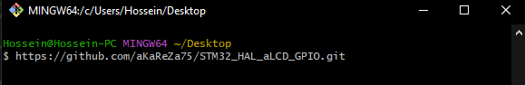
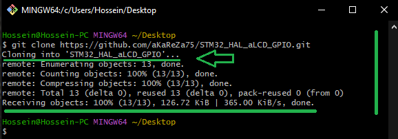
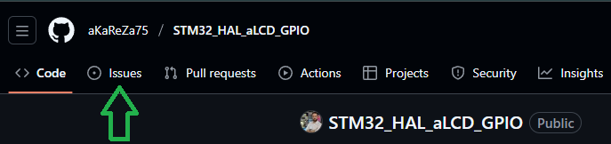
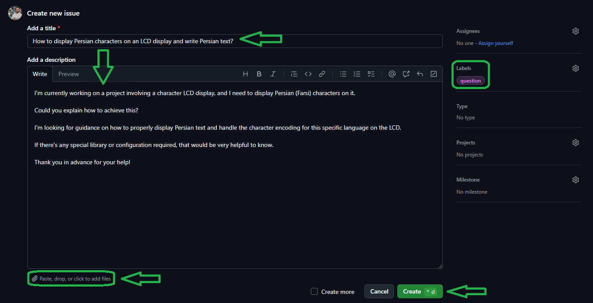

# Alphanumeric LCD Display Library for STM32

A comprehensive and flexible library for controlling 16x2 alphanumeric LCD displays with HD44780-compatible controllers using STM32 microcontrollers and HAL (Hardware Abstraction Layer). This library supports both 4-bit and 8-bit parallel communication modes.

## Overview

Alphanumeric LCD displays are character-based modules that can display text and custom characters. The most common configuration is 16x2 (16 characters per row, 2 rows), which this library is optimized for.

### Communication Modes

The HD44780 LCD controller supports two parallel communication modes:

#### **8-Bit Mode**
- Uses all 8 data lines (DB0-DB7)
- Faster data transmission (complete byte sent in one cycle)
- Requires more GPIO pins (10 pins total: RS, EN, DB0-DB7)
- Ideal for performance-critical applications with abundant GPIO

#### **4-Bit Mode** 
- Uses only 4 data lines (DB4-DB7)
- Slower data transmission (byte sent in two cycles: high nibble, then low nibble)
- Requires fewer GPIO pins (6 pins total: RS, EN, DB4-DB7)
- Ideal for GPIO-limited projects while maintaining full functionality

<table>
  <tr>
  <td valign="top">
  
  > [!TIP]  
  > If you're looking to better understand how to navigate and use my GitHub repositories — including exploring their structure, downloading or cloning projects, submitting issues, and asking questions,  
  > everything you need is clearly explained in this video:  
  > [aKaReZa 95 - Programming, Git - PART B](https://youtu.be/zYiUItVFRqQ)  
  > Make sure to check it out!
  
  </td>
    <td width="360" valign="middle" style="padding: 0;">
      <a href="https://youtu.be/zYiUItVFRqQ">
       
      </a>
    </td>
  </td>
  </tr>

<tr>
  <td valign="top">
  
  > [!IMPORTANT]
  > Begin your embedded systems journey with clarity and purpose. This episode outlines a structured roadmap for mastering microcontrollers, communication protocols, hardware design, and project development.  
  > Learn how to choose your specialization, follow curated playlists, and engage effectively with the community—ideal for learners seeking a scalable, goal-driven path into embedded engineering.  
  > [aKaReZa 124 – Embedded Systems Roadmap](https://youtu.be/3QYfv7A7aMc)  
  > Watch it now to kickstart your journey!
  
  </td>
  <td width="360" valign="middle" style="padding: 0;">
    <a href="https://youtu.be/3QYfv7A7aMc">
      
    </a>
  </td>
</tr>

  
  <tr>
  <td colspan="3">

  > [!CAUTION]
  > It is absolutely critical that you carefully read every single word of this document, line by line, to ensure you don't miss any details. Nothing can be overlooked.
      
  </td>
  </tr>  
</table>


### Library Features

✅ **Dual Mode Support**
- Complete 4-bit mode implementation
- Complete 8-bit mode implementation
- Easy switching between modes (separate source files)

✅ **Display Control**
- Initialize and configure LCD
- Clear display and control cursor position
- Display text strings and individual characters
- Control display, cursor, and blink states

✅ **Custom Characters**
- Create up to 8 custom 5×8 pixel characters
- Store in CGRAM for repeated use
- Perfect for icons, symbols, and special graphics

✅ **Backlight Control**
- Optional backlight ON/OFF control
- Transistor-driven for proper current handling

✅ **Flexible Pin Mapping**
- Easy pin configuration via header file
- Connect LCD to any available GPIO pins
- No hardcoded pin assignments
- Compatible with any STM32 GPIO port

✅ **Robust Implementation**
- Proper HD44780 initialization sequence
- HAL-based delay functions for accurate timing
- Position tracking and auto-wrapping
- Comprehensive error prevention

✅ **STM32 HAL Integration**
- Built on STM32 HAL library
- Compatible with STM32CubeMX generated code
- Works with all STM32 families (F0, F1, F3, F4, F7, H7, L0, L1, L4, etc.)
- Easy integration with existing STM32 HAL projects


# 🔗 Resources
  Here you'll find a collection of useful links and videos related to the topic of STM32 microcontrollers.  

> [!TIP]
> The resources are detailed in the sections below.  
> To access any of them, simply click on the corresponding blue link.

- [API Reference](./API_Reference.md)  
  ---  
  The aLCD Library provides a comprehensive driver for HD44780-compatible 16x2 LCDs on STM32 microcontrollers. It supports both 4-bit and 8-bit communication modes with flexible pin mapping via STM32CubeMX. The API includes functions for initialization, controlling the display, cursor, and backlight, and writing characters and strings to specific positions. Additionally, it allows for the creation and use of up to 8 custom characters.

- [STM32 Microcontroller Training](https://github.com/aKaReZa75/STM32)  
  ---  
  This repository offers a **comprehensive guide to STM32 microcontroller programming**, focusing on the STM32F103C8T6. Explore **STM32 architecture, peripheral configuration, timers, interrupts, communication protocols (UART, SPI, I2C), and real-time applications** through practical examples and hands-on projects. Whether you're a beginner or an experienced developer, this resource will help you build a strong foundation and advance your skills in STM32 embedded development.

## Project Videos

```plaintext
STM32, Alphanumeric LCD
└─ [aKaReZa 130 - HAL, aLCD]
      ├─ Project — Creating a new STM32 project.
      ├─ GPIO — Pin configuration for LCD connection.
      ├─ Header — Rewriting aKaReZa.h for STM32.
      ├─ Refactor — Adapting LCD functions to HAL.
      ├─ API — Core LCD functions overview.
      ├─ Performance — Techniques to boost display speed.
      └─ Repository — STM32-compatible alcd library usage.
```

<table style="border-collapse: collapse;">
  <tr style="background-color: #f9f9f9;">
    <td valign="top" style="middle: 0 10px;">
      <h3 style="margin: 0;">
        <a href="https://youtu.be/XsrOL4_7Ywc">aKaReZa 130 – STM32, HAL, aLCD</a>
      </h3>
      <p style="margin: 8px 0 0;">
        Bridge AVR and STM32 environments by adapting the <strong>aLCD library</strong> for STM32 using the HAL framework. This tutorial guides you through <strong>creating a new STM32 project</strong>, <strong>configuring GPIO pins</strong>, and <strong>rewriting the shared header file aKaReZa.h</strong>. You’ll also learn to <strong>refactor LCD functions for HAL</strong>, understand the <strong>core LCD API</strong>, and apply <strong>performance optimization techniques</strong>. Finally, the episode introduces the <strong>STM32-compatible alcd repository</strong>—a practical resource for reusing and enhancing LCD code across platforms.
      </p>
    </td>
    <td width="360" valign="middle">
      <a href="https://youtu.be/XsrOL4_7Ywc">
        
      </a>
    </td>
  </tr>
</table>


# 💻 How to Use Git and GitHub
To access the repository files and save them on your computer, there are two methods available:
1. **Using Git Bash and Cloning the Repository**
   - This method is more suitable for advanced users and those familiar with command-line tools.
   - By using this method, you can easily receive updates for the repository.

2. **Downloading the Repository as a ZIP file**
   - This method is simpler and suitable for users who are not comfortable with command-line tools.
   - Note that with this method, you will not automatically receive updates for the repository and will need to manually download any new updates.

## Clone using the URL.
First, open **Git Bash** :
-  Open the folder in **File Explorer** where you want the library to be stored.
-  **Right-click** inside the folder and select the option **"Open Git Bash here"** to open **Git Bash** in that directory.


> [!NOTE] 
> If you do not see the "Open Git Bash here" option, it means that Git is not installed on your system.  
> You can download and install Git from [this link](https://git-scm.com/downloads).  
> For a tutorial on how to install and use Git, check out [this video](https://youtu.be/BsykgHpmUt8).
  
-  Once **Git Bash** is open, run the following command to clone the repository:

 ```bash
git clone https://github.com/aKaReZa75/STM32_HAL_aLCD_GPIO.git
```
- You can copy the above command by either:
- Clicking on the **Copy** button on the right of the command.
- Or select the command text manually and press **Ctrl + C** to copy.
- To paste the command into your **Git Bash** terminal, use **Shift + Insert**.



- Then, press Enter to start the cloning operation and wait for the success message to appear.



> [!IMPORTANT]
> Please keep in mind that the numbers displayed in the image might vary when you perform the same actions.  
> This is because repositories are continuously being updated and expanded. Nevertheless, the overall process remains unchanged.

> [!NOTE]
> Advantage of Cloning the Repository:  
> - **Receiving Updates:** By cloning the repository, you can easily and automatically receive new updates.  
> - **Version Control:** Using Git allows you to track changes and revert to previous versions.  
> - **Team Collaboration:** If you are working on a project with a team, you can easily sync changes from team members and collaborate more efficiently.  

## Download Zip
If you prefer not to use Git Bash or the command line, you can download the repository directly from GitHub as a ZIP file.  
Follow these steps:  
1. Navigate to the GitHub repository page and Locate the Code button:
   - On the main page of the repository, you will see a green Code button near the top right corner.

2. Download the repository:
   - Click the Code button to open a dropdown menu.
   - Select Download ZIP from the menu.

    

3. Save the ZIP file:
   - Choose a location on your computer to save the ZIP file and click Save.

4. Extract the ZIP file:
   - Navigate to the folder where you saved the ZIP file.
   - Right-click on the ZIP file and select Extract All... (Windows) or use your preferred extraction tool.
   - Choose a destination folder and extract the contents.

5. Access the repository:
   - Once extracted, you can access the repository files in the destination folder.

> [!IMPORTANT]
> - No Updates: Keep in mind that downloading the repository as a ZIP file does not allow you to receive updates.    
>   If the repository is updated, you will need to download it again manually.  
> - Ease of Use: This method is simpler and suitable for users who are not comfortable with Git or command-line tools.

# 📝 How to Ask Questions
If you have any questions or issues, you can raise them through the **"Issues"** section of this repository. Here's how you can do it:  

1. Navigate to the **"Issues"** tab at the top of the repository page.  

  

2. Click on the **"New Issue"** button.  
   
  

3. In the **Title** field, write a short summary of your issue or question.  

4. In the "Description" field, detail your question or issue as thoroughly as possible. You can use text formatting, attach files, and assign the issue to someone if needed. You can also use text formatting (like bullet points or code snippets) for better readability.  

5. Optionally, you can add **labels**, **type**, **projects**, or **milestones** to your issue for better categorization.  

6. Click on the **"Submit new issue"** button to post your question or issue.
   
  

I will review and respond to your issue as soon as possible. Your participation helps improve the repository for everyone!  

> [!TIP]
> - Before creating a new issue, please check the **"Closed"** section to see if your question has already been answered.  
>     
> - Write your question clearly and respectfully to ensure a faster and better response.  
> - While the examples provided above are in English, feel free to ask your questions in **Persian (فارسی)** as well.  
> - There is no difference in how they will be handled!  

> [!NOTE]
> Pages and interfaces may change over time, but the steps to create an issue generally remain the same.

# 🤝 Contributing to the Repository
To contribute to this repository, please follow these steps:
1. **Fork the Repository**  
2. **Clone the Forked Repository**  
3. **Create a New Branch**  
4. **Make Your Changes**  
5. **Commit Your Changes**  
6. **Push Your Changes to Your Forked Repository**  
7. **Submit a Pull Request (PR)**  

> [!NOTE]
> Please ensure your pull request includes a clear description of the changes you’ve made.
> Once submitted, I will review your contribution and provide feedback if necessary.

# 🌟 Support Me
If you found this repository useful:
- Subscribe to my [YouTube Channel](https://www.youtube.com/@aKaReZa75).
- Share this repository with others.
- Give this repository and my other repositories a star.
- Follow my [GitHub account](https://github.com/aKaReZa75).

# 📜 License
This project is licensed under the GPL-3.0 License. This license grants you the freedom to use, modify, and distribute the project as long as you:
- Credit the original authors: Give proper attribution to the original creators.
- Disclose source code: If you distribute a modified version, you must make the source code available under the same GPL license.
- Maintain the same license: When you distribute derivative works, they must be licensed under the GPL-3.0 too.
- Feel free to use it in your projects, but make sure to comply with the terms of this license.
  
# ✉️ Contact Me
Feel free to reach out to me through any of the following platforms:
- 📧 [Email: aKaReZa75@gmail.com](mailto:aKaReZa75@gmail.com)
- 🎥 [YouTube: @aKaReZa75](https://www.youtube.com/@aKaReZa75)
- 💼 [LinkedIn: @akareza75](https://www.linkedin.com/in/akareza75)
